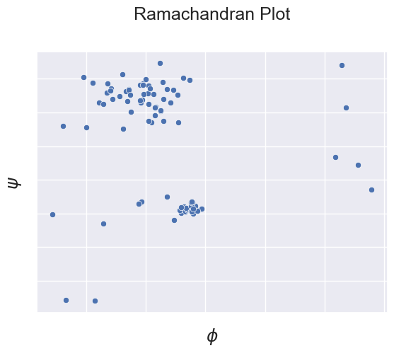

# Structural Bioinformatics `VMD-tcl` project

This project consists of multiple `tcl` modules, which perform following tasks on a given protein `pdb` file (`NMR` structure):

1. Find the **amino acid sequence** of the protein along with the **number of amino acids**.
2. Write a procedure to find the **secondary structure sequence** of the protein in each frame of the trajectory along with the **percentage of each secondary structure** type.
3. Compute the **$\phi$** and **$\psi$** angles for the protein and plot the **Ramachandran** plot using whatever plotting package you like.
4. Write a procedure to calculate the **RMSD** matrix for the trajectory (**RMSD** between every 2 frames).
5. Write a procedure to output following information for each atom in the **hbonds**:
	- Amino acid id
	- Amino acid name
	- Secondary structure type
	- $\omega$ angle
	- $\phi$ angle
	- $\psi$ angle
	- Radius of gyration

## Modules
In this section, we'll introduce each module in the order of its corresponding task:
### 1. `amino_acids.tcl`
It provides the `get_amino_acids {mul}` `proc` which gets a `mul` ID as the input, and prints out **amino acids sequence** and their **counts** in the provided protein.

Example usage:
```tcl
set mul [mol load pdb 2pph.pdb]
source amino_acids.tcl
get_amino_acids $mul
```

Example output:
```tcl
Amino acids sequence:
GLN SER ASP VAL ARG ILE LYS PHE GLU HIS ASN GLY GLU ARG ARG ILE ILE ALA PHE SER ARG PRO VAL LYS TYR GLU ASP VAL GLU HIS LYS VAL THR THR VAL PHE GLY GLN PRO LEU ASP LEU HIS TYR MET ASN ASN GLU LEU SER ILE LEU LEU LYS ASN GLN ASP ASP LEU ASP LYS ALA ILE ASP ILE LEU ASP ARG SER SER SER MET LYS SER LEU ARG ILE LEU LEU LEU SER GLN ASP ARG ASN LEU GLU HIS HIS HIS HIS HIS HIS

Amino acid counts:
	GLN: 4
	SER: 8
	ASP: 9
	VAL: 5
	ARG: 7
	ILE: 7
	LYS: 6
	PHE: 3
	GLU: 6
	HIS: 9
	ASN: 5
	GLY: 2
	ALA: 2
	PRO: 2
	TYR: 2
	THR: 2
	LEU: 12
	MET: 2
```

### 2. `secondary_structure.tcl`
It provides the `secondary_structure_info {file}` `proc` which gets a `pdb` `file` name as the input, iterates through every frame of the protein, and writes out the protein **secondary structure sequence** along with the **percentage** of each secondary structure type in a **secondary_structure.txt** file.

Example usage:
```tcl
source secondary_structure.tcl
secondary_structure_info 2pph.pdb
```

Example output:
```tcl
frame 0
C C C C C C C C C C C C C C C C C C C C C C C C C C C C C C C C C C C C C C C E E E E E E E E E E E E E E E E E E E E E E E E E E E E E E E E E E E E E E E E E E E E E E E E E E E E E E E E E E E E E E E E E E E E E E E E E E E E E E E E E E E E E E E E E E E E E E E E E E E E E E E E E E E E E E E E E E E E E E E E E E E E E E E E E E E E E E T T T T T T T T T T T T T T T T T T T T T E E E E E E E E E E E E E E E E E E E E E E E E E E E E E E E E E E E E E E E E E E E E E E E E E E E E E E E E E E E E E E E E E E E E E E E E E E E E E E E E E E E E E E E E E E E E E E E E E E E E E E E E E E E E E E E E E E E E E E E E E E E E E E E E E E E T T T T T T T T T T T T T T T T T T T T T T T T T T T T T T T T T T T T T T T T T T T T T T T T T T T T T T T T T T T T T T T T T C C C C C C C C C C C C C C C C C C C C C C H H H H H H H H H H H H H H H H H H H H H H H H H H H H H H H H H H H H H H H H H H H H H H H H H H H H H H H H H H H H H H H H H H H H H H H H H H H H H H H H H H H H H H H H H H H H H H H H H H H H H H H H H H H H H H H H H H H H H H H H H H H H H H H H H H H H H H H H H H H H H H H H H H H H H H H H H H H H H H H H H H H H H H H H H H H H H H H H H H H H H H H H H H H H H H H H H H H H H H H C C C C C C C C C C C C C C C C C C C C C C C C C C C C C C C C C C C C C C E E E E E E E E E E E E E E E E E E E E E E E E E E E E E E E E E E E E E E E E E E E E E E E E E E E E E E E E E E E E E E E E E E E E E E E E E E E E E E E E E E E E E E E E E E E E E E E E E E E E E E E E E E T T T T T T T T T T T T T T T T T T T T T T T T T T T T T T T T T T T T T T T T T T T T T T T T T T T T T T T T T T T T T T E E E E E E E E E E E E E E E E E E E E E E E E E E E E E E E E E E E E E E E E E E E E E E E E E E E E E E E E E E E E E E E E E E E E C C C C C C C C C C C C C C C C C C C C C C C C C C C C C C C C C C C C H H H H H H H H H H H H H H H H H H H H H H H H H H H H H H H H H H H H H H H H H H H H H H H H H H H H H H H H H H H H H H H H H H H H H H H H H H H H H H H H H H H H H H H H H H H H H H H H H H H H H H H H H H H H H H H H H H H H H H H H H H H H H H H H H H H H H H H H H H H H H H H H H H H H H H H H H H H H H H H H H H H H H H H H H H H H H H H H H H H H H H H H H H H H H H H H H H H H H H H H H H H H H H H H H T T T T T T T T T T T T T T T T T T T T T T T T T T T T T T T T T T T T T T T T T T T T T T T T T T C C C C C C C C C C C C C C C C C C C C C C C C C C C C C C C C C E E E E E E E E E E E E E E E E E E E E E E E E E E E E E E E E E E E E E E E E E E E E E E E E E E E E E E E E E E E E E E E E E E E E E E E E E E E E E E E E E E E E E E E E E E E E E E E E E E E E E E E E E E E E E E E E E E E E E E E E E E E E E E E E E E C C C C C C C C C C C C C C C C C C C C C C C C C C C C C C C C C C C C C C C C C C C C C C C C C C C C C C C C C C C C C C C C C C C C C C C C C C C C C C C C C C C C C C C C C C C C C C C C C C C C C C C C C C C C C C C C C C C C C C C C C C C C C C C C C C C C C C C C C C C C C C C C C C C C C C C C C C C C C C C C C C C C C C C C C C C C C C C C C C C C C C C C C C C C C C C C C C C C C C C C C C C C C C C C C C

percentage of each secondary structure:
	C: 24.339987121699934
	E: 36.63876368319382
	T: 12.749517063747584
	H: 26.27173213135866
------------------------------------------------
frame 1
C C C C C C C C C C C C C C C C C C C C C C C C C C C C C C C C C C C C C C C E E E E E E E E E E E E E E E E E E E E E E E E E E E E E E E E E E E E E E E E E E E E E E E E E E E E E E E E E E E E E E E E E E E E E E E E E E E E E E E E E E E E E E E E E E E E E E E E E E E E E E E E E E E E E E E E E E E E E E E E E E E E E E E E E E E E E E T T T T T T T T T T T T T T T T T T T T T E E E E E E E E E E E E E E E E E E E E E E E E E E E E E E E E E E E E E E E E E E E E E E E E E E E E E E E E E E E E E E E E E E E E E E E E E E E E E E E E E E E E E E E E E E E E E E E E E E E E E E E E E E E E E E E E E E E E E E E E E E E E E E E E E E E T T T T T T T T T T T T T T T T T T T T T T T T T T T T T T T T T T T T T T T T T T T T T T T T T T T T T T T T T T T T T T T T T C C C C C C C C C C C C C C C C C C C C C C H H H H H H H H H H H H H H H H H H H H H H H H H H H H H H H H H H H H H H H H H H H H H H H H H H H H H H H H H H H H H H H H H H H H H H H H H H H H H H H H H H H H H H H H H H H H H H H H H H H H H H H H H H H H H H H H H H H H H H H H H H H H H H H H H H H H H H H H H H H H H H H H H H H H H H H H H H H H H H H H H H H H H H H H H H H H H H H H H H H H H H H H H H H H H H H H H H H H H H H C C C C C C C C C C C C C C C C C C C C C C C C C C C C C C C C C C C C C C E E E E E E E E E E E E E E E E E E E E E E E E E E E E E E E E E E E E E E E E E E E E E E E E E E E E E E E E E E E E E E E E E E E E E E E E E E E E E E E E E E E E E E E E E E E E E E E E E E E E E E E E E E T T T T T T T T T T T T T T T T T T T T T T T T T T T T T T T T T T T T T T T T T T T T T T T T T T T T T T T T T T T T T T E E E E E E E E E E E E E E E E E E E E E E E E E E E E E E E E E E E E E E E E E E E E E E E E E E E E E E E E E E E E E E E E E E E E C C C C C C C C C C C C C C C C C C C C C C C C C C C C C C C C C C C C H H H H H H H H H H H H H H H H H H H H H H H H H H H H H H H H H H H H H H H H H H H H H H H H H H H H H H H H H H H H H H H H H H H H H H H H H H H H H H H H H H H H H H H H H H H H H H H H H H H H H H H H H H H H H H H H H H H H H H H H H H H H H H H H H H H H H H H H H H H H H H H H H H H H H H H H H H H H H H H H H H H H H H H H H H H H H H H H H H H H H H H H H H H H H H H H H H H H H H H H H H H H H H H H H T T T T T T T T T T T T T T T T T T T T T T T T T T T T T T T T T T T T T T T T T T T T T T T T T T C C C C C C C C C C C C C C C C C C C C C C C C C C C C C C C C C E E E E E E E E E E E E E E E E E E E E E E E E E E E E E E E E E E E E E E E E E E E E E E E E E E E E E E E E E E E E E E E E E E E E E E E E E E E E E E E E E E E E E E E E E E E E E E E E E E E E E E E E E E E E E E E E E E E E E E E E E E E E E E E E E E C C C C C C C C C C C C C C C C C C C C C C C C C C C C C C C C C C C C C C C C C C C C C C C C C C C C C C C C C C C C C C C C C C C C C C C C C C C C C C C C C C C C C C C C C C C C C C C C C C C C C C C C C C C C C C C C C C C C C C C C C C C C C C C C C C C C C C C C C C C C C C C C C C C C C C C C C C C C C C C C C C C C C C C C C C C C C C C C C C C C C C C C C C C C C C C C C C C C C C C C C C C C C C C C C C

percentage of each secondary structure:
	C: 24.339987121699934
	E: 36.63876368319382
	T: 12.749517063747584
	H: 26.27173213135866
------------------------------------------------
.
.
.
```

### 3. `phi_psi.tcl`
It provides the `save_phi_psi {mul}` `proc` which gets a `mul` ID as input and saves the $\phi$, $\psi$ angles of each residue in the **phi_psi.txt** file.

Example usage:
```tcl
set mul [mol load pdb 2pph.pdb]
source phi_psi.tcl
save_phi_psi $mul
```
There is also a `ramachandran.ipynb` jupyter notebook which you can run in order to plot the *Ramachandran* plot from the **phi_psi.txt**.

Example output:
```tcl
-149.8152618408203 78.09329223632812
-169.8335418701172 80.33543395996094
-82.07330322265625 134.80934143066406
-97.96881866455078 113.00837707519531
.
.
.
```


### 4. `rmsd.tcl`
It provides the `rmsd_frames {file}` `proc` which gets a `pdb` `file` name as the input, and fills up a `rmsd_matrix` which is a $\text{nframes} \times \text{nframes}$ matrix with their corresponding *rmsd* distance (using `measure rmsd`).
The resulting `rmsd_matrix` will be saved as a `csv` file, named **rmsd.csv**.
The procedure also returns the `rmsd_matrix`.

Example usage:
```tcl
source rmsd.tcl
rmsd_frames 2pph.pdb
```

Example output:
```tcl
{0.0 9.246414184570312 6.7342729568481445 10.854466438293457 4.742458820343018 7.212343215942383 ...}
{9.246414184570312 0.0 11.020564079284668 8.762266159057617 6.88718843460083 4.7826762199401855 ...}
{6.7342729568481445 11.020564079284668 0.0 8.231124877929688 8.41441822052002 8.574283599853516 ...}
.
.
.
```

### 5. `hbonds.tcl`
It provides the `proc get_hbonds {mol}` `proc` which gets a `mul` ID as input, then using the `measure hbonds`, finds the index of the atoms contributing in the *hbonds* and provides the following attributes for each selected atom: {*resid*, *resname*, *structure*, $\phi$, $\psi$, $\omega$, *rgyr*}.
Note that unlike $\phi$ and $\psi$, $\omega$ is not calculated by the *VMD*, so we provided another procedure called `omega_dihedral {mul  resid}`  which selects the $C_\alpha$, $C$ atoms of the given residue, and $N$,  $C_\alpha$ of the next residue in the chain, and returns the $\omega$ angle as: $$\omega = \texttt{measure dihed } \{ C_\alpha, C, N^{+1}, C^{+1}_\alpha \}$$
<sub>$+1$ superpos indicates the next residue atoms.</sub>

Finally the `proc get_hbonds {mol}` procedure, writes out the results as a `csv` file, named **hbonds.csv** and also returns the result list.

Example usage:
```tcl
set mul [mol load pdb 2pph.pdb]
source hbonds.tcl
get_hbonds $mul
```

Example output:
```tcl
{0 17 ILE E -128.9705352783203 135.92227172851562 179.8340606689453 2.276962995529175}
{1 19 PHE E -128.30465698242188 119.76545715332031 179.73878479003906 2.7349960803985596}
{2 28 VAL H -70.32777404785156 -48.989620208740234 179.5020751953125 2.050771951675415}
.
.
.
```
